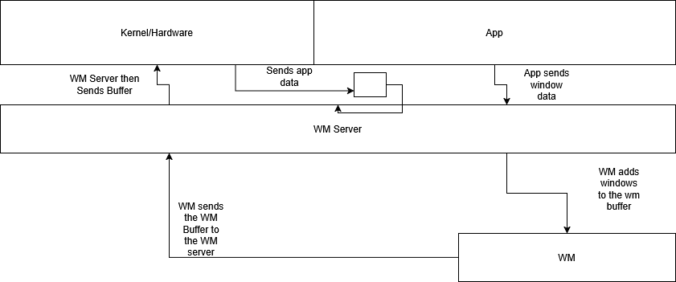

# TWM
turtle wm
just some docs for an ai
# What is TWM?
twm is the turtle window manager.

above is how it works here is a description in words:
 
the kernel passes a list of gui apps to the twm that then takes the content of the windows plus some more metadata and then the twm server sends it to the actual wm which modifies the windows and sends the buffer back to the window server which sends it to the render location in the kernel which will print out all the pixels.
# Why this method
This method is kind of like traditional wm servers but easier to understand.
